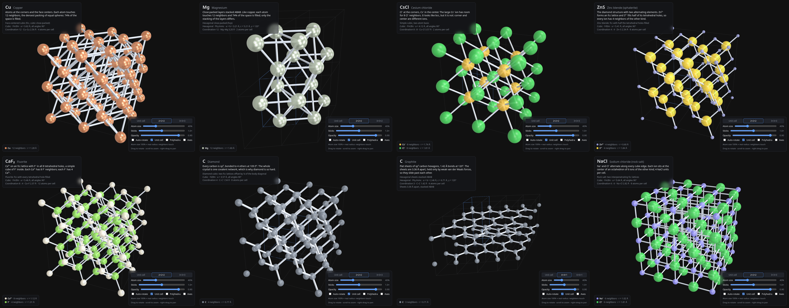
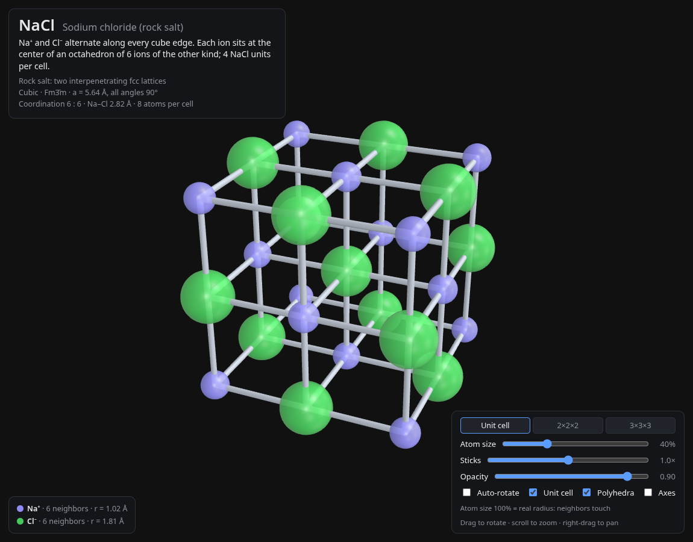
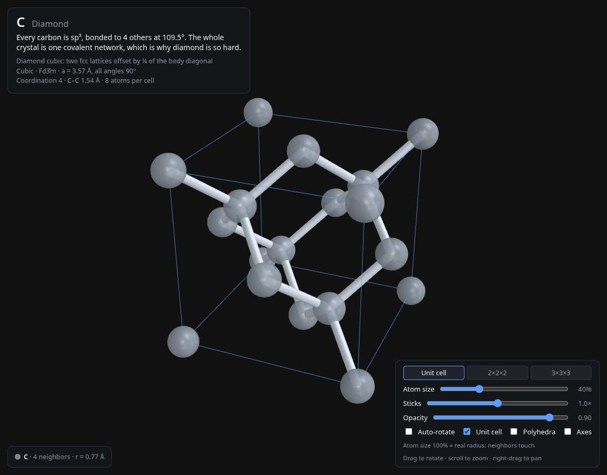
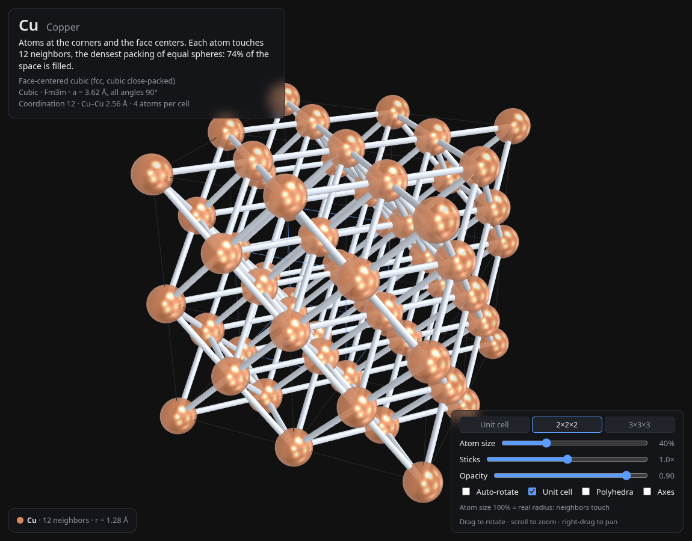

# Crystal Viewer

An interactive 3D viewer for **real crystal structures**, drawn ball and stick
with three.js. Every structure is built from its actual crystallographic data:
lattice constants, cell angles, atom positions, and coordination. The third app
in a small chemistry visualization suite, alongside the
[Electron Orbital Viewer](https://github.com/jfblanchard/electron-orbital-viewer).



## What's included

- **Metals**: Na (bcc), Cu (fcc), Mg (hcp).
- **Ionic**: NaCl (rock salt), CsCl, ZnS (zinc blende), CaF₂ (fluorite).
- **Covalent network**: diamond.
- **Layered**: graphite.
- **Display**: unit cell, 2×2×2 or 3×3×3 tiling; atom size (100% = real radius,
  so neighbors touch); stick thickness; opacity; coordination polyhedra; axes;
  auto-rotate.
- **Facts panel**: space group, lattice constants, nearest-neighbor distance,
  coordination number, and atoms per cell for each structure.

## Screenshots

| NaCl | Diamond | Cu |
|:---:|:---:|:---:|
|  |  |  |

## Try it live

**<https://crystal-viewer.pages.dev>**

## Structure data

Room-temperature lattice constants, from standard crystallographic tables.
`deploy/test_structures.mjs` checks them, along with bond lengths, angles, and
coordination, against an independent reference set.

| Structure | Lattice | Space group | a (Å) | c (Å) | Coordination |
|---|---|---|---|---|---|
| Na | body-centered cubic | Im3̄m | 4.29 | | 8 |
| Cu | face-centered cubic | Fm3̄m | 3.615 | | 12 |
| Mg | hexagonal close-packed | P6₃/mmc | 3.209 | 5.211 | 12 |
| NaCl | fcc, two interpenetrating lattices | Fm3̄m | 5.64 | | 6 : 6 |
| CsCl | simple cubic, two-atom basis | Pm3̄m | 4.123 | | 8 : 8 |
| ZnS | zinc blende | F4̄3m | 5.409 | | 4 : 4 |
| CaF₂ | fluorite | Fm3̄m | 5.463 | | 8 : 4 |
| Diamond | diamond cubic | Fd3̄m | 3.567 | | 4 |
| Graphite | hexagonal, ABAB stacking | P6₃/mmc | 2.464 | 6.711 | 3 |

## Run locally

```bash
cd deploy
python3 -m http.server 8000
# open http://localhost:8000   (a server is required for ES modules)
```

To deploy your own copy to Cloudflare Pages:

```bash
cd deploy
npx wrangler pages deploy . --project-name <your-project-name>
```

## Tests

```bash
cd deploy
node --test test_structures.mjs
```

`tests/shoot.mjs` takes headless screenshots of a running local server.

## Layout

```
deploy/   self-contained web app, the deploy unit
tests/    headless screenshot script
assets/   README screenshots
```

## License / source

Source: <https://github.com/jfblanchard/crystal-viewer>

MIT License (see LICENSE).
